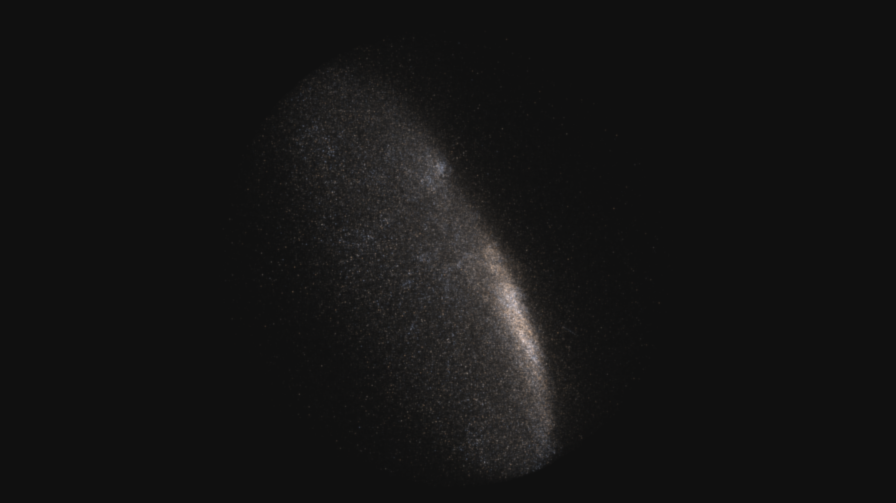
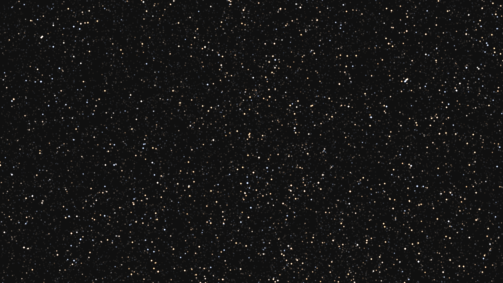
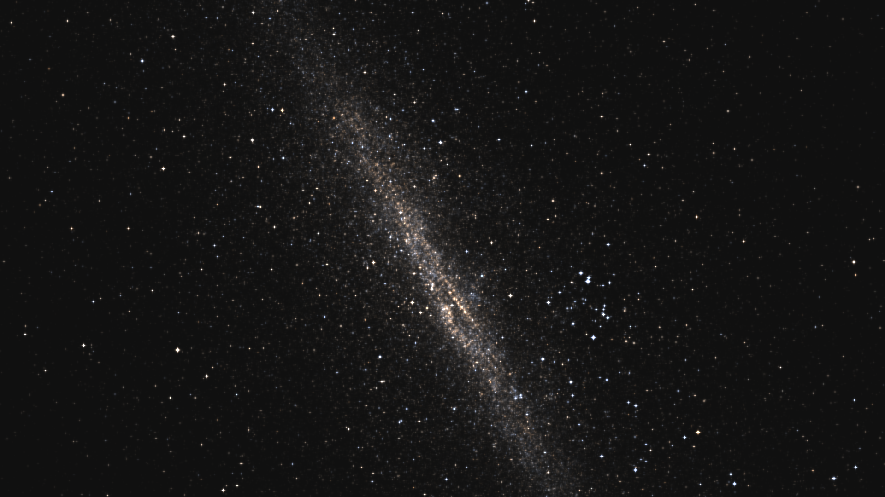
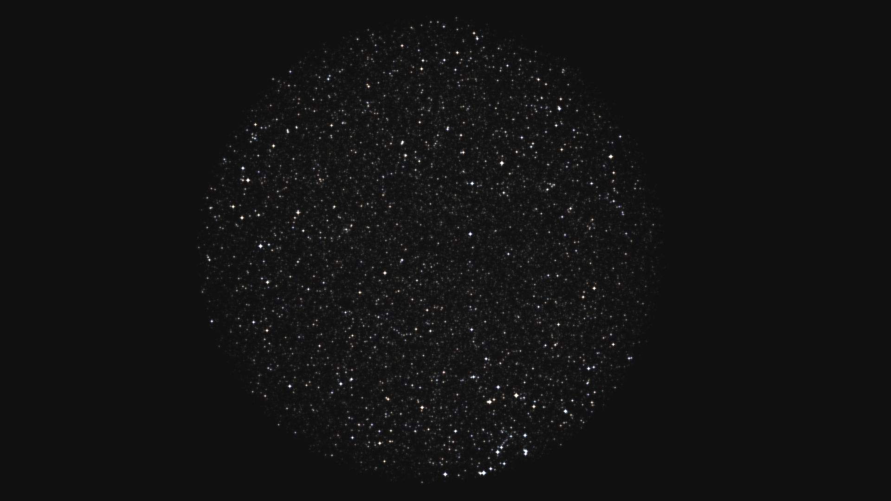

# Gaia Explorer

Explore real stars from Gaia data releases.

## Showcase
<div align="center">
  

  

  

  
</div>

## Prerequisites

### SFML

```bash
sudo apt update
sudo apt install libsfml-dev
```

### GLEW

```bash
sudo apt update
sudo apt install libglew-dev
```

## Build

```bash
make
```

# Controls

| Bind | Action |
|-|-|
| `ESC` | Quit |
| `F1` | Toggle GUI |
| `0` or `Home` | Teleport to `0,0,0` |
| `W` | Move forward |
| `S` | Move backward |
| `A` | Move left |
| `D` | Move right |
| `Space` | Move up |
| `Control` | Move down |
| `+` | Increase camera exposure |
| `-` | Decrease camera exposure |
| `R` | ×10 camera speed |
| `F` | ÷10 camera speed |
| `C` | Set camera speed to `1c` *(speed of light)* |
| `Scroll Up` | Increase camera speed |
| `Scroll Down` | Decrease camera speed |
| `Right Click` + `Scroll Up` | Zoom in |
| `Right Click` + `Scroll Down` | Zoom out |


## Implementation

Star positions are converted to Cartesian coordinates centered on the Sun (`0,0,0`), derived from Gaia right ascension, declination and parallax measurements.

Positions are stored as a 64-bit signed integer in kilometers. This allows 1 km precision, while being able to represent coordinates from -298.909 kpc *(-974'911 ly)* to 298.909 kpc *(974'911 ly)*.

## Performance

On my system *(AMD Ryzen 5 3600, NVIDIA GeForce GTX 1650)*, the application renders 1'000'000 stars in real time with a peak frame time of \~11 ms (\~90 FPS).

